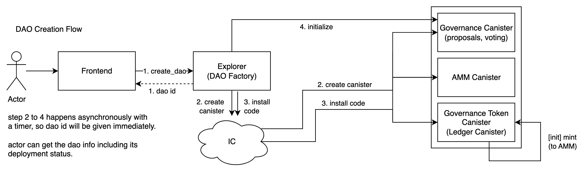

# SUDAO

A no-code decentralized autonomous organization (DAO) maker platform built on the Internet Computer (ICP) blockchain, enabling DAOs to be accessible to wider communities.

## Overview

SUDAO is a comprehensive DAO platform that allows communities to create, manage, and participate in decentralized governance. Built with modern web technologies and the Internet Computer's unique capabilities, SUDAO provides a secure, transparent, and efficient way to organize collective decision-making.

## Features

- **DAO Creator**: Create and manage DAO deployments on the ICP blockchain
- **Community Governance**: Create and manage DAOs with customizable governance structures
- **Proposal System**: Submit, discuss, and vote on proposals with transparent tracking
- **Token-Based Voting**: Weighted voting based on governance token holdings
- **Real-time Updates**: Live updates on proposal status and voting results
- **Secure Authentication**: NFID integration for secure user authentication
- **Responsive Design**: Modern, mobile-friendly interface built with React and Tailwind CSS

## Technology Stack

- **Frontend**: React, TypeScript, Tailwind CSS, Framer Motion
- **Backend**: Motoko (Internet Computer's native language)
- **Authentication**: NFID Identity Kit
- **Blockchain**: Internet Computer (ICP)
- **Development**: DFX SDK, Vite

## Submission Resources

- [Pitch Deck Video](https://youtu.be/C4q-juc0KyY)
- [Pitch Deck](https://drive.google.com/file/d/1ssQfTGgyZ3DV84S9qIPyU77ICzvQbND9/view?usp=sharing)
- [Demo Video](https://youtu.be/3LeY-Os9cPs)

## How To Use

If you haven't installed IC SDK and mops already, please install them first. This applies to both BE and FE.

1. [IC SDK Install Guide](https://internetcomputer.org/docs/motoko/install). You can install the motoko vscode extension as well.
2. [mops Install Guide](https://j4mwm-bqaaa-aaaam-qajbq-cai.ic0.app/docs/install). Make sure you run `mops install` in the end.

If you want to start working on your project right away, you might want to try the following commands:

```bash
cd sudao/
dfx help
dfx canister --help
```

## Running the project locally

If you want to test your project locally, you can use the following commands:

```bash
# Starts the replica, running in the background
dfx start --background

# Deploys your canisters to the replica and generates your candid interface
dfx deploy
```

Once the job completes, your application will be available at `http://localhost:4943?canisterId={asset_canister_id}`.

Any subsequent changes to BE need to redeploy the canisters.

Always don't forget to run the replica! If you encounter `Error: You are trying to connect to the local replica but dfx cannot connect to it` then you need to start the replica again.

## DAO Creation Flow



## Application Snapshots


